# UI Flows & Screen Map — NexCommerce

> **Version:** 1.1.0
> **Last Updated:** 2026-09-05
> **Status:** Active — Normative for frontend implementation
> **Related Docs:** [prd.md](./prd.md) · [architecture.md](./architecture.md) · [error-codes.md](./error-codes.md) · [env.md](./env.md)
> **Personas:** Priya (Customer), Raj (Vendor), Arun (Delivery Partner), Meera (Admin) — see PRD Section 3

Single source of truth for every screen, route, role-guard, and user flow. Backend contracts, error codes, and env flags referenced inline. If a screen isn't here, don't build it without updating this file first.

> **Rendering note:** all diagrams below use Mermaid (renders natively on GitHub, GitLab, and VS Code Markdown Preview) plus plain-ASCII fallbacks inside collapsible blocks. No box-drawing characters are used, so nothing breaks on mobile or narrow windows.

---

## Table of Contents

1. [Global Site Map](#1-global-site-map)
2. [Flow Legend and Conventions](#2-flow-legend-and-conventions)
3. [Customer Flow](#3-customer-flow)
4. [Vendor Flow](#4-vendor-flow)
5. [Delivery Partner Flow](#5-delivery-partner-flow)
6. [Admin Flow](#6-admin-flow)
7. [Shared Auth and Account Flows](#7-shared-auth-and-account-flows)
8. [Screen Inventory](#8-screen-inventory)
9. [Screen Specifications](#9-screen-specifications)
10. [State, Empty and Error Handling](#10-state-empty-and-error-handling)
11. [Navigation Guards and Routing Matrix](#11-navigation-guards-and-routing-matrix)
12. [Screen to API Wiring](#12-screen-to-api-wiring)
13. [Checkout Saga Sequence](#13-checkout-saga-sequence)
14. [Search and AI Sequences](#14-search-and-ai-sequences)
15. [Vendor, Delivery and Admin Sequences](#15-vendor-delivery-and-admin-sequences)
16. [State Machines](#16-state-machines)
17. [Detailed Screen Specs - Customer](#17-detailed-screen-specs---customer)
18. [Detailed Screen Specs - Vendor](#18-detailed-screen-specs---vendor)
19. [Detailed Screen Specs - Delivery, Admin and Shared](#19-detailed-screen-specs---delivery-admin-and-shared)
20. [Wireframes](#20-wireframes)
21. [Analytics Events per Screen](#21-analytics-events-per-screen)
22. [Responsive and Accessibility Notes](#22-responsive-and-accessibility-notes)

---

## 1. Global Site Map

High-level IA. `LOCK` = auth required. `ROLE` = role-gated.

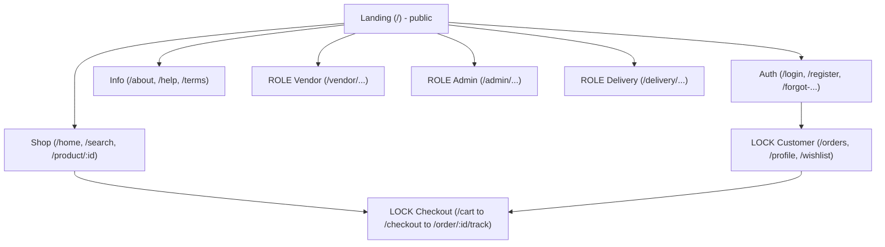
```mermaid
flowchart TD
    Landing["Landing (/) - public"] --> Auth["Auth (/login, /register, /forgot-...)"]
    Landing --> Shop["Shop (/home, /search, /product/:id)"]
    Landing --> Info["Info (/about, /help, /terms)"]
    Auth --> Customer["LOCK Customer (/orders, /profile, /wishlist)"]
    Shop --> Checkout["LOCK Checkout (/cart to /checkout to /order/:id/track)"]
    Customer --> Checkout
    Landing --> Vendor["ROLE Vendor (/vendor/...)"]
    Landing --> Admin["ROLE Admin (/admin/...)"]
    Landing --> Delivery["ROLE Delivery (/delivery/...)"]
```

Role entry points after login:

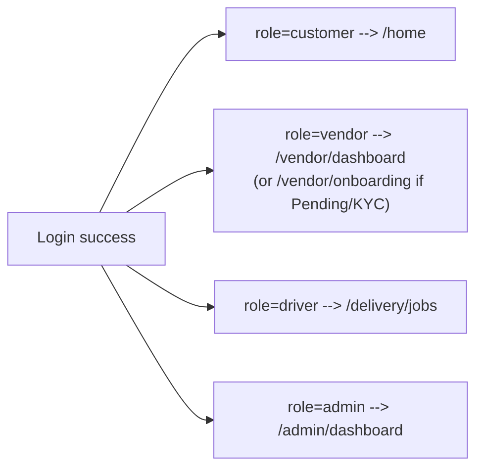
```mermaid
flowchart LR
    Login["Login success"] --> C["role=customer --> /home"]
    Login --> V["role=vendor --> /vendor/dashboard\n(or /vendor/onboarding if Pending/KYC)"]
    Login --> D["role=driver --> /delivery/jobs"]
    Login --> A["role=admin --> /admin/dashboard"]
```

<details>
<summary>Plain-ASCII fallback (click to expand)</summary>

```text
Landing (/) public
  +-- Auth (/login, /register, /forgot-password)
  |     +-- LOCK Customer (/orders, /profile, /wishlist, /notifications)
  +-- Shop (/home, /search, /product/:id)
  |     +-- LOCK Checkout (/cart -> /checkout -> /order/:id/confirmation -> /order/:id/track)
  +-- Info (/about, /help, /terms)
  +-- ROLE Vendor (/vendor/...)
  +-- ROLE Admin (/admin/...)
  +-- ROLE Delivery (/delivery/...)

login success
  +-- role=customer --> /home
  +-- role=vendor   --> /vendor/dashboard (or /vendor/onboarding if Pending/KYC)
  +-- role=driver   --> /delivery/jobs
  +-- role=admin    --> /admin/dashboard
```

</details>

---

## 2. Flow Legend and Conventions

```text
[Screen]   = UI screen (maps to Section 8 route)
  | / v    = forward navigation (click / submit / auto-redirect)
  +--      = branch (user choice or system decision)
  {?}      = decision point (described inline)
  (API)    = backend call - see Section 12
  [ERR]    = error / edge path - see Section 10 (codes in MONO)
  LOCK     = auth guard (redirect to /login?next=<route>)
  WAIT     = async / polling / websocket state
```

- All money in paise/cents integers. All timestamps ISO-8601.
- Every mutating flow uses idempotency keys where noted (checkout, payment retry).
- Error `code`s reference [error-codes.md](./error-codes.md). Never branch UI on message text.

---

## 3. Customer Flow

### 3.1 Registration and Onboarding

Canonical flow (from requirements — preserved):

```text
Landing Page
  |
  +-- Click "Sign Up"
  |     |
  |     v
  |   Register Page
  |     |
  |     v
  |   Email Verification
  |     |
  |     v
  |   Phone OTP Verification
  |     |
  |     v
  |   Profile Setup (Name, Address)
  |     |
  |     v
  |   Homepage (Personalized)
  |
  +-- Click "Login with Google"
        |
        v
      Google OAuth
        |
        v
      Homepage
```

Detailed version as a visual diagram:

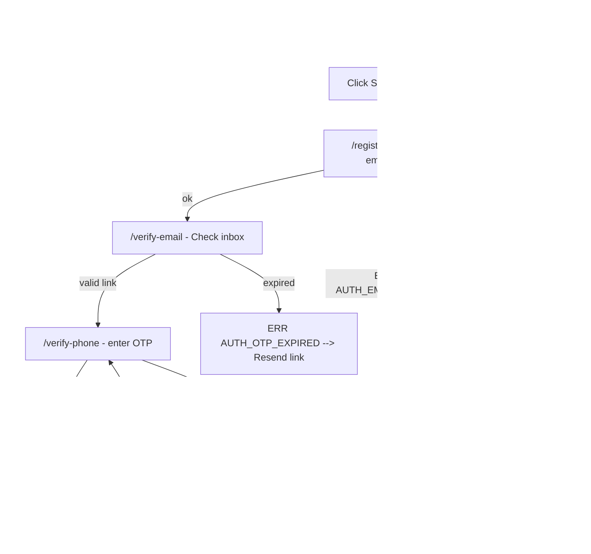
```mermaid
flowchart TD
    L["Landing (/)"] --> SU["Click Sign Up --> /register"]
    L --> GO["Click Login with Google --> OAuth"]
    SU --> REG["/register submit (name, email, password)"]
    REG -->|ERR AUTH_EMAIL_EXISTS| REG
    REG -->|ok| VE["/verify-email - Check inbox"]
    VE -->|valid link| VP["/verify-phone - enter OTP"]
    VE -->|expired| VE2["ERR AUTH_OTP_EXPIRED --> Resend link"]
    VP -->|ERR AUTH_OTP_INVALID| VP
    VP -->|ok| PS["/profile/setup (Name, Address)"]
    PS --> H["/home personalized"]
    GO -->|new user| H
    GO -->|existing| H
```

<details>
<summary>Plain-ASCII fallback (click to expand)</summary>

```text
[/] Landing
  +-- CTA "Sign Up" --> [/register]
  +-- CTA "Login with Google" --> (OAuth) --> {linked?}
        +-- yes --> issue JWT --> [/home] (US-003)
        +-- no (new user) --> create account --> [/home] + toast "Welcome!"

[/register] submit (name, email, password 12+ upper/lower/num/special)
  (API: POST /api/v1/auth/register)
  +-- [ERR] AUTH_EMAIL_EXISTS --> inline "Email already registered. Log in?"
  +-- [ERR] VALIDATION_FAILED / AUTH_PASSWORD_WEAK --> field-level errors
  +-- ok --> [/verify-email?email=...] "Check your inbox"
        (API: POST /auth/verify-email, 24h TTL)
        +-- valid link --> email verified --> [/verify-phone]
        +-- expired --> [ERR] AUTH_OTP_EXPIRED --> "Resend link" button
        +-- unverified tries to shop --> [ERR] AUTH_EMAIL_NOT_VERIFIED --> banner + resend

[/verify-phone] enter OTP (6-digit)
  (API: POST /auth/verify-phone)
  +-- [ERR] AUTH_OTP_INVALID --> retry counter (5 attempts) --> lockout AUTH_RATE_LIMITED WAIT 15m
  +-- ok --> [/profile/setup] (Name, default Address + geocode FR-007)
        +-- skips? allowed, but checkout later forces address (see 3.2)
        +-- save --> [/home] personalized hero + onboarding checklist dismissed
```

</details>

Related: Section 7 (login, forgot password), Section 8 rows `/`, `/register`, `/verify-email`, `/verify-phone`, `/profile/setup`, `/home`.

### 3.2 Purchase Flow (Search to Tracking)

Canonical flow (preserved):

```text
Homepage
  |
  +-- Search Bar (AI Semantic)
        |
        v
      Search Results Page
        +-- Filters (Price, Brand, Rating, Category)
        +-- Sort (Relevance, Price, Rating)
        +-- Click Product
              |
              v
            Product Detail Page
              +-- Images Gallery
              +-- Add to Cart Button
              +-- Buy Now Button
              +-- AI Chatbot (floating)
              +-- Similar Products
              +-- Reviews Section
                    |
                    v
                  Cart Page
                    +-- Item List (grouped by vendor)
                    +-- Price Summary
                    +-- Proceed to Checkout
                          |
                          v
                        Checkout Page
                          +-- Delivery Address
                          +-- Payment Method
                          +-- Order Summary
                          +-- Place Order Button
                                |
                                v
                              Payment (Stripe)
                                |
                                v
                              Order Confirmation Page
                                |
                                v
                              Order Tracking Page
```

Visual diagram (happy path + failure branches):

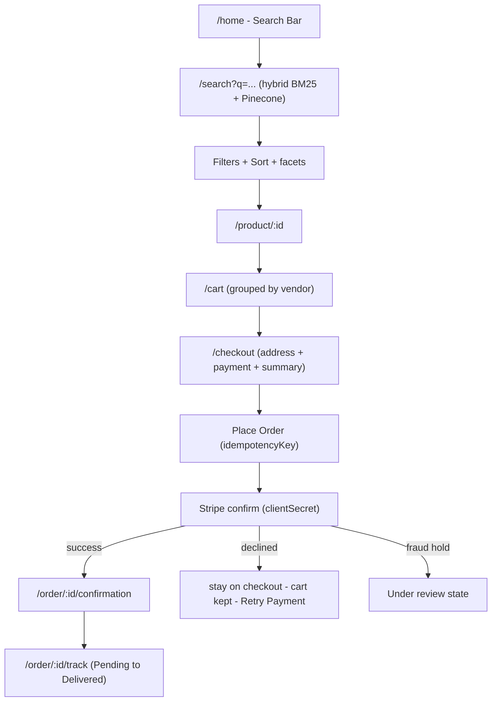
```mermaid
flowchart TD
    Home["/home - Search Bar"] --> Search["/search?q=... (hybrid BM25 + Pinecone)"]
    Search --> Filters["Filters + Sort + facets"]
    Filters --> PDP["/product/:id"]
    PDP --> Cart["/cart (grouped by vendor)"]
    Cart --> Checkout["/checkout (address + payment + summary)"]
    Checkout --> PlaceOrder["Place Order (idempotencyKey)"]
    PlaceOrder --> Stripe["Stripe confirm (clientSecret)"]
    Stripe -->|success| Confirm["/order/:id/confirmation"]
    Stripe -->|declined| Retry["stay on checkout - cart kept - Retry Payment"]
    Stripe -->|fraud hold| Review["Under review state"]
    Confirm --> Track["/order/:id/track (Pending to Delivered)"]
```

<details>
<summary>Plain-ASCII fallback (click to expand)</summary>

```text
[/home] types in Search Bar (3+ chars --> autocomplete dropdown, ES suggest)
  +-- submit --> [/search?q=<query>] (API: GET /search?q=&filters=&sort=&cursor=)
        +-- hybrid results: keyword (BM25) + semantic (Pinecone) tabs/badges
        +-- [ERR] SEARCH_QUERY_TOO_SHORT --> inline hint
        +-- [ERR] SEARCH_INDEX_UNAVAILABLE --> retry banner (retryable:true)
        +-- [WARN] SEARCH_VECTOR_FALLBACK --> "Showing keyword results" chip (still success:true)
  +-- Filters drawer: Price slider, Brand, Rating, Category tree (facets from API)
  +-- Sort: Relevance | Price up/down | Rating | Newest
  +-- {empty results} --> empty state: illustration + "Try 'warm winter jacket'" + popular searches
  +-- click product card --> [/product/:id]

[/product/:id] Product Detail
  +-- Sections: Images Gallery (WebP thumb/med/large + zoom) | title | rating + count
  +-- price + price-history sparkline | variant picker (size/color --> SKU)
  +-- stock badge ({out of stock} --> [ERR] PRODUCT_OUT_OF_STOCK + "Notify me")
  +-- [Add to Cart] (API: POST /cart, Redis lock 15m) | [Buy Now] (add + jump /checkout)
  +-- AI Chatbot floating (RAG: "Is this good for skiing?" --> streams GPT-4o, cart-aware)
  +-- [ERR] AI_SERVICE_UNAVAILABLE --> chatbot shows "AI offline" + hides (search still works)
  +-- Similar Products carousel (recommendation embeddings) | Reviews Section
        +-- [Write Review] LOCK (only Delivered buyers; else [ERR] REVIEW_NOT_ELIGIBLE)

[/cart] Cart (LOCK; anonymous cart merges on login per FR-026)
  +-- Grouped by vendor (split fulfillment note) | qty steppers | remove | wishlist move
  +-- Price Summary: subtotal + shipping + tax (by address) + commission-invisible
  +-- [ERR] ORDER_CART_EXPIRED --> "Cart expired, re-add" + back to product
  +-- [ERR] PRODUCT_INVENTORY_LOCK_FAILED --> "Someone just grabbed the last one" + refresh qty
  +-- [Proceed to Checkout] --> [/checkout]

[/checkout] Checkout (LOCK)
  +-- Steps: 1 Delivery Address (default, geocoded) --> 2 Payment (Stripe Elements)
  +--        --> 3 Order Summary (items, totals, idempotencyKey client-generated)
  +-- [ERR] USER_DEFAULT_ADDRESS_REQUIRED --> force add address modal
  +-- [Place Order] (API: POST /orders/checkout {idempotencyKey})
        +-- [ERR] ORDER_DUPLICATE_IDEMPOTENCY_KEY --> return ORIGINAL order (no double charge)
        +-- [ERR] ORDER_INVENTORY_FAILED --> highlight dead SKUs + "Remove and continue"
        +-- ok order Pending created --> saga starts (Inventory --> Payment --> Delivery)
  +-- Stripe confirm (clientSecret) --> {result?}
        +-- success --> webhook PaymentSuccess --> order Paid --> [/order/:id/confirmation]
             confetti + receipt + [Track Order] + [Continue Shopping] + push/email receipt
        +-- declined --> [ERR] ORDER_PAYMENT_FAILED / PAYMENT_CARD_DECLINED --> stay on checkout,
             cart KEPT, "Try another card" + [Retry Payment] (new intent, same idempotency scope)
        +-- fraud hold --> [ERR] PAYMENT_FRAUD_HOLD --> "Under review" state + support link

[/order/:id/confirmation] --> [Track Order] --> [/order/:id/track]
  Timeline: Pending --> Paid --> Processing --> Shipped --> Delivered (FR-030)
  WAIT live driver map (WebSocket room per order) | ETA | proof-of-delivery photo on delivered
  Actions by state: [Cancel] (only Pending, else [ERR] ORDER_CANNOT_CANCEL)
                   [Return] (Delivered <14d, else [ERR] ORDER_RETURN_WINDOW_EXPIRED)
                   [Reorder] | [Review] | [Invoice PDF]
```

</details>

Alternate customer micro-flows:

```text
Wishlist: [/product/:id] heart --> [/wishlist] --> move to cart --> /cart
Notifications: bell badge --> [/notifications] (order/dispatched/delivered, price drops)
Profile: [/profile] edit name/avatar (<2MB else [ERR] USER_AVATAR_TOO_LARGE)
  | [/addresses] CRUD (exactly 1 default)
  | [/preferences] toggles email/SMS/push (unsub --> NOTIFICATION_UNSUBSCRIBED CTA resubscribe)
Order history: [/orders] paginated + filters (status) --> [/order/:id] --> track/return/reorder
Chatbot anywhere: floating button --> drawer --> (API: POST /ai/chat, cart+history injected FR-056)
  +-- [ERR] AI_RATE_LIMIT --> "Slow down, retry in X" with backoff
```

---

## 4. Vendor Flow

Canonical dashboard map (preserved):

```text
Vendor Dashboard (Sidebar Navigation):
+-- Overview (Revenue, Orders, Rating KPIs)
+-- Products
|   +-- Product List
|   +-- Add Product (AI description generator)
|   +-- Inventory Management
+-- Orders
|   +-- New Orders
|   +-- Processing
|   +-- Completed / Cancelled
+-- Payouts
|   +-- Balance Overview
|   +-- Payout History
|   +-- Bank Account Settings
+-- Reviews
|   +-- All Reviews
|   +-- Respond to Reviews
+-- Analytics
|   +-- Sales Charts
|   +-- Top Products
|   +-- Customer Demographics
+-- Settings
    +-- Store Profile
    +-- KYC Documents
    +-- Notification Preferences
```

### 4.1 Vendor Onboarding and KYC (gates everything)

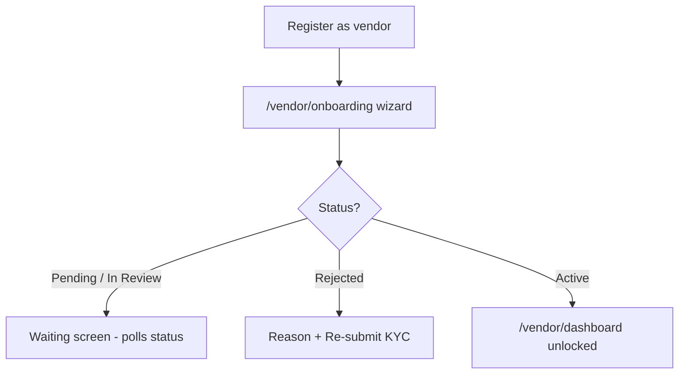
```mermaid
flowchart TD
    Reg["Register as vendor"] --> Wiz["/vendor/onboarding wizard"]
    Wiz --> Pending{"Status?"}
    Pending -->|Pending / In Review| Wait["Waiting screen - polls status"]
    Pending -->|Rejected| Resub["Reason + Re-submit KYC"]
    Pending -->|Active| Dash["/vendor/dashboard unlocked"]
```

<details>
<summary>Plain-ASCII fallback (click to expand)</summary>

```text
register as vendor --> [/vendor/onboarding] wizard (business details --> store slug --> Stripe Express)
  (API: POST /vendors + /vendors/kyc + Stripe onboarding link)
  state machine: Pending --> In Review --> Active | Rejected --> Suspended (FR-011)
  {status?}
  +-- Pending/In Review --> waiting screen ("Usually <24h") + [ERR] VENDOR_NOT_APPROVED
  |   on product create / payout attempts; polls status WAIT
  +-- Rejected --> reason + [Re-submit KYC] (private S3, presigned URLs 15m, FR-012)
  +-- Active --> [/vendor/dashboard] unlocked
  +-- [ERR] VENDOR_STRIPE_ONBOARDING_INCOMPLETE --> banner "Finish Stripe to receive payouts" (FR-015)
  +-- [ERR] VENDOR_STORE_SLUG_TAKEN --> inline slug suggest (store-name-2)
```

</details>

### 4.2 Vendor Operations Detail

```text
[/vendor/dashboard] Overview: Revenue GMV, Orders, Avg rating, Low-stock alerts, Payout pending
  +-- cards link deep: click Revenue --> /vendor/analytics
  +-- click New Orders --> /vendor/orders?status=new

[/vendor/products] Table: thumb, title, SKU count, price, stock, status, rating
  +-- [Add Product] --> [/vendor/products/new] form:
       title + category tree + attributes (JSONB variants) + price + images (WebP auto)
       [Generate with AI] (API: POST /ai/describe {title, features})
         --> streams SEO description --> editable textarea --> [Use] inserts
         [ERR] AI_SERVICE_UNAVAILABLE --> button disabled w/ tooltip, manual field stays
       [ERR] PRODUCT_DUPLICATE_SKU --> highlight variant row
       [ERR] PRODUCT_IMAGE_INVALID --> per-file error
       [Publish] --> success --> indexed to ES+Pinecone async (SEARCH_SYNC_LAG note "appears in ~1m")
  +-- bulk CSV: [Import] --> upload --> background job --> progress WAIT --> report
       [ERR] PRODUCT_BULK_IMPORT_FAILED --> download error CSV (row, reason)
  +-- [/vendor/products/:id/edit] + [/vendor/inventory] stock deltas (ledger: inventory_transactions)
       [ERR] PRODUCT_STATUS_INVALID --> "Complete price + images to publish"

[/vendor/orders] Tabs: New | Processing | Completed | Cancelled
  +-- row --> drawer: items, customer city (no PII excess), saga state, [Mark Ready] [Print label]
  +-- [ERR] ORDER_INVALID_STATE_TRANSITION --> disabled buttons reflect state machine

[/vendor/payouts] Balance Overview (pending vs available), Payout History (Stripe Connect transfers),
  Bank Account Settings (Stripe Express portal link)
  +-- [ERR] VENDOR_PAYOUT_MINIMUM --> "Minimum Rs 500" progress bar to threshold

[/vendor/reviews] All Reviews (filter flagged/toxic) + [Reply] nested under review (parent_review_id)
  +-- [ERR] REVIEW_FLAGGED_TOXIC items show "Hidden - under admin review" (Meera's queue)

[/vendor/analytics] Sales Charts (GMV time-series), Top Products (SKU, sold), Demographics
  +-- [Export CSV] --> async WAIT --> ANALYTICS_REPORT_PENDING --> download link (FR-054)
  +-- [ERR] ANALYTICS_TENANT_FORBIDDEN --> never (vendor_id enforced server-side)
  +-- [Ask AI "top category this month?"] --> NL-to-SQL (US-059) --> chart + SQL shown collapsible

[/vendor/settings] Store Profile (logo/banner/policies --> live storefront preview)
  KYC Documents (re-upload --> back to In Review) | Notification Preferences (toggles)
  Commission tier card (read-only % from VENDOR module)
```

---

## 5. Delivery Partner Flow (Arun)

Mobile-first (budget Android, battery-aware, offline-tolerant).

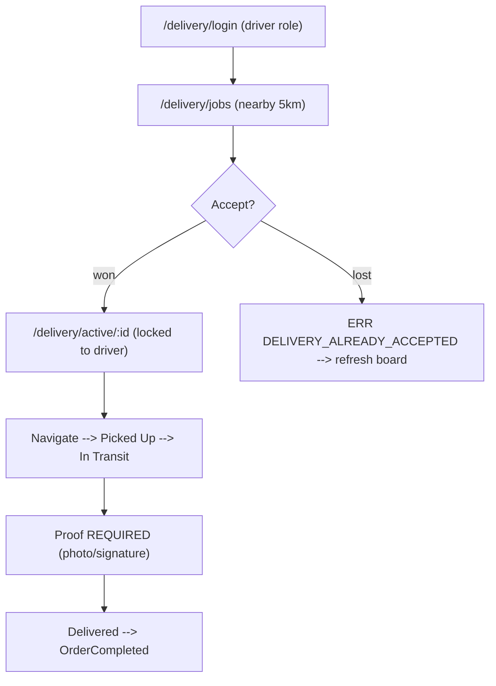
```mermaid
flowchart TD
    DL["/delivery/login (driver role)"] --> JB["/delivery/jobs (nearby 5km)"]
    JB --> Accept{"Accept?"}
    Accept -->|won| Active["/delivery/active/:id (locked to driver)"]
    Accept -->|lost| Lost["ERR DELIVERY_ALREADY_ACCEPTED --> refresh board"]
    Active --> Navigate["Navigate --> Picked Up --> In Transit"]
    Navigate --> Proof["Proof REQUIRED (photo/signature)"]
    Proof --> Delivered["Delivered --> OrderCompleted"]
```

<details>
<summary>Plain-ASCII fallback (click to expand)</summary>

```text
[/delivery/login] (driver role) --> [/delivery/jobs] job board (nearby 5km PostGIS, FR-036)
  +-- card: pickup, drop area, fee, distance --> [Accept]
  +-- {accept race?}
        +-- won --> [/delivery/active/:id] (locked to driver)
        +-- lost --> [ERR] DELIVERY_ALREADY_ACCEPTED --> refresh board

[/delivery/active/:id] WAIT WebSocket GPS uplink (throttled to save battery)
  +-- Steps: [Navigate] (Google Maps deep link, route FR-040) --> [Picked Up] --> [In Transit]
  +--        --> [Arrive] --> proof REQUIRED (photo/signature, else [ERR] DELIVERY_PROOF_REQUIRED)
  +--        --> [Delivered] --> triggers OrderCompleted --> customer notified
  +-- [ERR] DELIVERY_LOCATION_STALE --> "GPS lost" banner, keep last-known pin
  +-- [ERR] DELIVERY_ASSIGNMENT_EXPIRED (60s no-accept, FR-038) --> auto re-routed, toast
  +-- [Drop / Reassign] --> system rebroadcasts (SLA 15m stall)

[/delivery/earnings] daily/weekly payouts chart + trip history
[/delivery/profile] vehicle, availability toggle (offline --> removed from dispatch)
```

</details>

Customer sees driver only via [/order/:id/track] map room (Socket.io) + "Driver arriving" SMS/push (Notification fan-out).

---

## 6. Admin Flow (Meera)

Desktop console. Every action audit-logged (append-only, `ADMIN_AUDIT_IMMUTABLE`).

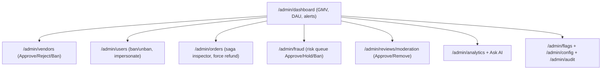
```mermaid
flowchart TD
    AD["/admin/dashboard (GMV, DAU, alerts)"] --> AV["/admin/vendors (Approve/Reject/Ban)"]
    AD --> AU["/admin/users (ban/unban, impersonate)"]
    AD --> AO["/admin/orders (saga inspector, force refund)"]
    AD --> AF["/admin/fraud (risk queue Approve/Hold/Ban)"]
    AD --> AM["/admin/reviews/moderation (Approve/Remove)"]
    AD --> AN["/admin/analytics + Ask AI"]
    AD --> FL["/admin/flags + /admin/config + /admin/audit"]
```

<details>
<summary>Plain-ASCII fallback (click to expand)</summary>

```text
[/admin/dashboard] KPIs: GMV, DAU, orders/min, search conversion, chatbot resolution, uptime
  +-- alerts lane: fraud holds, toxic reviews, failed webhooks, ES lag --> deep links

[/admin/vendors] queue: Pending --> [Approve] [Reject w/ reason] (API: VendorApproved/KycApproved)
  +-- row --> vendor 360 view: KYC docs (presigned 15m viewer), store, products, payouts, audit
  +-- [Ban] --> sessions revoked (Auth consumes UserBanned) --> status Suspended

[/admin/users] search/ban/unban, [Impersonate] (superadmin only, else [ERR] ADMIN_IMPERSONATION_DENIED)
  +-- impersonation banner "Viewing as Priya - Exit" + audit entry (FR-064)

[/admin/orders] all orders + saga inspector (state transitions log) + [Force refund] (superadmin)
[/admin/fraud] risk queue (score 0-100: IP mismatch, velocity, value sigma) --> [Approve] [Hold] [Ban]
  +-- order shows [ERR] AI_FRAUD_REVIEW_REQUIRED to customer while held
[/admin/reviews/moderation] toxic queue (score>0.8 auto-hidden, REVIEW_FLAGGED_TOXIC) --> [Approve] [Remove]
[/admin/analytics] platform BI (ClickHouse materialized views, 5m Redis cache) + [Export]
  +-- [Ask AI] NL query --> generated SQL shown + runnable
[/admin/flags] feature flags toggles (instant via pub/sub FR-062) + rollout %
[/admin/config] platform fees/commission ([ERR] ADMIN_CONFIG_INVALID on bad %), maintenance toggle
[/admin/audit] immutable log table (who, what, when) - no edit/delete buttons by design
[/admin/health] services: Postgres/Redis/ES/Pinecone/Stripe/OpenAI status dots (mirrors /health/ready)
```

</details>

Admin decision tree (fraud/moderation):

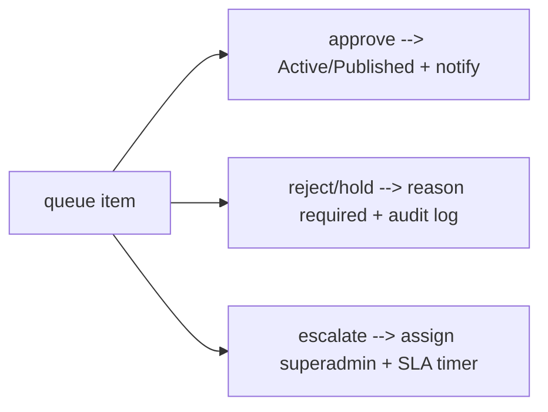
```mermaid
flowchart LR
    Q["queue item"] --> A["approve --> Active/Published + notify"]
    Q --> R["reject/hold --> reason required + audit log"]
    Q --> E["escalate --> assign superadmin + SLA timer"]
```

---

## 7. Shared Auth and Account Flows

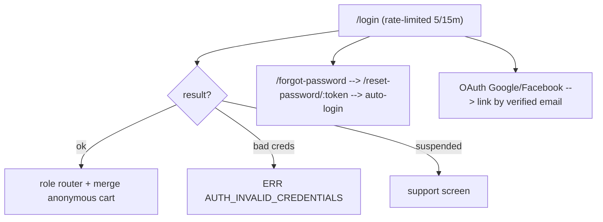
```mermaid
flowchart TD
    LG["/login (rate-limited 5/15m)"] --> OK{"result?"}
    OK -->|ok| Router["role router + merge anonymous cart"]
    OK -->|bad creds| Bad["ERR AUTH_INVALID_CREDENTIALS"]
    OK -->|suspended| Sup["support screen"]
    LG --> FP["/forgot-password --> /reset-password/:token --> auto-login"]
    LG --> OA["OAuth Google/Facebook --> link by verified email"]
```

<details>
<summary>Plain-ASCII fallback (click to expand)</summary>

```text
[/login] email+password (rate-limited 5/15m [ERR] AUTH_RATE_LIMITED)
  +-- ok --> role router (see Section 1) + merge anonymous cart (FR-026)
  +-- [ERR] AUTH_INVALID_CREDENTIALS --> generic error (no enumeration)
  +-- [ERR] AUTH_ACCOUNT_SUSPENDED / AUTH_SESSION_REVOKED --> support screen
  +-- [Forgot password?] --> [/forgot-password] email --> "If account exists, link sent"
  |     --> [/reset-password/:token] new password (policy FR-004) --> auto-login --> /home
  +-- [Login with Google/Facebook] (OAuth FR-002) --> link by verified email
        [ERR] AUTH_OAUTH_LINK_FAILED --> "Email in use - log in to link" screen

Header (authed): search | wishlist | cart badge | bell badge --> /notifications | avatar -->
  Profile | Addresses | Orders | Preferences | (vendor: Dashboard) (admin: Console) | Logout
  Logout --> revoke session (Redis) --> [/] landing

Guards: visiting LOCK route unauthed --> [/login?next=<original>] --> after login return to `next`
        visiting ROLE route wrong role --> [ERR] AUTH_INSUFFICIENT_ROLE --> 403 page + "Switch account"
```

</details>

---

## 8. Screen Inventory

Canonical rows (from requirements — preserved) marked with `*`. `Auth Yes` = login required.

### 8.1 Canonical Screens

| Screen Name | Route | User Role | Auth |
| :--- | :--- | :--- | :---: |
| Landing Page * | / | All | No |
| Register * | /register | All | No |
| Login * | /login | All | No |
| Homepage * | /home | Customer | Yes |
| Search Results * | /search?q= | Customer | No |
| Product Detail * | /product/:id | Customer | No |
| Cart * | /cart | Customer | Yes |
| Checkout * | /checkout | Customer | Yes |
| Order Confirmation * | /order/:id/confirmation | Customer | Yes |
| Order Tracking * | /order/:id/track | Customer | Yes |
| Order History * | /orders | Customer | Yes |
| Vendor Dashboard * | /vendor/dashboard | Vendor | Yes |
| Add Product * | /vendor/products/new | Vendor | Yes |
| Admin Dashboard * | /admin/dashboard | Admin | Yes |
| Vendor Management * | /admin/vendors | Admin | Yes |

### 8.2 Extended — Auth and Account

| Screen Name | Route | User Role | Auth |
| :--- | :--- | :--- | :--- |
| Forgot Password | /forgot-password | All | No |
| Reset Password | /reset-password/:token | All | No |
| Email Verification | /verify-email | All | No |
| Phone OTP Verification | /verify-phone | All | No |
| Profile Setup (onboarding) | /profile/setup | Customer | Yes |
| Profile | /profile | All authed | Yes |
| Address Book | /addresses | Customer | Yes |
| Wishlist | /wishlist | Customer | Yes |
| Notification Center | /notifications | All authed | Yes |
| Order Detail | /order/:id | Customer | Yes |
| 403 Forbidden | /403 | All | No |
| 404 Not Found | /404 (catch-all `*`) | All | No |
| 500 Error | /500 | All | No |
| Maintenance | /maintenance | All | No |

### 8.3 Extended — Vendor

| Screen Name | Route | User Role | Auth |
| :--- | :--- | :--- | :--- |
| Vendor Onboarding Wizard | /vendor/onboarding | Vendor | Yes |
| Product List | /vendor/products | Vendor | Yes |
| Edit Product | /vendor/products/:id/edit | Vendor | Yes |
| Inventory Management | /vendor/inventory | Vendor | Yes |
| Bulk Import | /vendor/products/import | Vendor | Yes |
| Vendor Orders | /vendor/orders | Vendor | Yes |
| Vendor Order Detail | /vendor/orders/:id | Vendor | Yes |
| Payouts Overview | /vendor/payouts | Vendor | Yes |
| Payout Detail | /vendor/payouts/:id | Vendor | Yes |
| Vendor Reviews | /vendor/reviews | Vendor | Yes |
| Vendor Analytics | /vendor/analytics | Vendor | Yes |
| Store Settings | /vendor/settings | Vendor | Yes |
| Public Storefront | /store/:slug | All | No |

### 8.4 Extended — Delivery Partner

| Screen Name | Route | User Role | Auth |
| :--- | :--- | :--- | :--- |
| Delivery Login | /delivery/login | Driver | No |
| Job Board | /delivery/jobs | Driver | Yes |
| Active Delivery | /delivery/active/:id | Driver | Yes |
| Delivery History and Earnings | /delivery/earnings | Driver | Yes |
| Driver Profile | /delivery/profile | Driver | Yes |

### 8.5 Extended — Admin

| Screen Name | Route | User Role | Auth |
| :--- | :--- | :--- | :--- |
| User Management | /admin/users | Admin | Yes |
| Order Management | /admin/orders | Admin | Yes |
| Order Saga Inspector | /admin/orders/:id | Admin | Yes |
| Fraud Review Queue | /admin/fraud | Admin | Yes |
| Review Moderation | /admin/reviews/moderation | Admin | Yes |
| Platform Analytics | /admin/analytics | Admin | Yes |
| Feature Flags | /admin/flags | Admin | Yes |
| System Configuration | /admin/config | Admin | Yes |
| Audit Logs | /admin/audit | Admin | Yes |
| Service Health | /admin/health | Admin | Yes |

---

## 9. Screen Specifications

Each spec: purpose, key components, primary CTAs, API, states. Standard header/footer/nav implied.

**Landing (`/`)** — Convert visitors. Hero + semantic search teaser + trending + vendor CTA ("Sell on NexCommerce" to `/vendor/onboarding`). Public, SEO-optimized.

**Homepage (`/home`, LOCK customer)** — Personalized: greeting, recommendation rail (collaborative embeddings), recent orders shortcut, category tiles. (API: `GET /recommendations`, `GET /orders?limit=3`.)

**Search Results (`/search?q=`)** — Public. Autocomplete (3+ chars), facet sidebar (price/brand/rating/category), sort bar, cursor pagination, sponsored slot (future). Degrades per Section 3.2 fallback chip.

**Product Detail (`/product/:id`)** — Public. Gallery, variant matrix (invalid combo gives `PRODUCT_INVALID_VARIANT` inline), stock, price + history, Add/Buy, chatbot button, similar rail, reviews (paginated, `Most helpful`). CTA hierarchy: Buy Now (primary), Add to Cart (secondary), Wishlist (icon).

**Cart (`/cart`)** — Vendor-grouped lines, qty steppers (max stock clamp), summary card (sticky on mobile), trust badges (secure Stripe, returns 14d). CTA: Proceed to Checkout.

**Checkout (`/checkout`)** — 3-step wizard with progress rail; address radio + "Add new" modal; Stripe Elements card form (never raw PAN); summary with idempotency key shown in dev only. CTA: Place Order (disabled until valid + locks held).

**Confirmation (`/order/:id/confirmation`)** — Success hero, order number copy button, ETA, receipt table, CTAs: Track Order (primary), Continue Shopping, Download Invoice.

**Tracking (`/order/:id/track`)** — Vertical timeline + live map (WAIT websocket `order:<id>` room) + driver card (masked phone) + proof photo on delivery + contextual actions (Cancel/Return/Reorder per state).

**Vendor Dashboard (`/vendor/dashboard`)** — KPI cards (Revenue, Orders, Rating, Low stock, Payout pending) + charts (7d GMV) + action inbox (new orders, flagged reviews, KYC banner if gated).

**Add Product (`/vendor/products/new`)** — Two-column: form left, live preview right. AI button with streaming state + char count + SEO score. Publish shows toast + redirect to product list with "Indexed — appears in search shortly".

**Admin Dashboard (`/admin/dashboard`)** — KPI wall + alert swimlanes (fraud, moderation, webhooks, health). Every alert links to its queue (Section 6).

Mobile notes: Customer + Delivery are mobile-first (bottom nav: Home, Search, Cart, Orders, Account). Vendor + Admin are desktop-first, tablet-tolerant (sidebar collapses to drawer below 1024px).

---

## 10. State, Empty and Error Handling

| Situation | Screen Behavior | Code |
| :--- | :--- | :--- |
| Loading | Skeletons (cards, table rows); map shows shimmer pin | — |
| Empty search | Illustration + suggestions + popular searches | — |
| Empty cart/orders/wishlist/earnings | Illustration + CTA (Shop now / Add product / Go online) | — |
| Token expired | Silent refresh, retry once; else login redirect | `AUTH_TOKEN_EXPIRED` |
| Session revoked/banned | Force logout + support screen | `AUTH_SESSION_REVOKED`, `AUTH_ACCOUNT_SUSPENDED` |
| Out of stock at checkout | Inline row error + remove/replace | `ORDER_INVENTORY_FAILED` |
| Payment declined | Stay on checkout, cart kept, new intent | `ORDER_PAYMENT_FAILED` |
| AI down | Chatbot hidden/disabled; keyword results with chip | `AI_SERVICE_UNAVAILABLE` |
| No drivers | Retry + ETA unknown + support | `DELIVERY_NO_DRIVERS` |
| Report generating | Progress + email/download when done | `ANALYTICS_REPORT_PENDING` |
| 404 | Friendly page + search box + home link | `NOT_FOUND`, `PRODUCT_NOT_FOUND` |
| 500 | "Ref: requestId" + retry + support | `INTERNAL_ERROR` |
| Maintenance | Full-page notice + `retryAfter` countdown | `MAINTENANCE_MODE` |
| Offline (delivery app) | Queue GPS + actions, sync on reconnect | — |

Form rule: field errors inline under input; page-level errors in banner with `requestId` copy button. Toasts auto-dismiss 5s except errors (sticky + close).

---

## 11. Navigation Guards and Routing Matrix

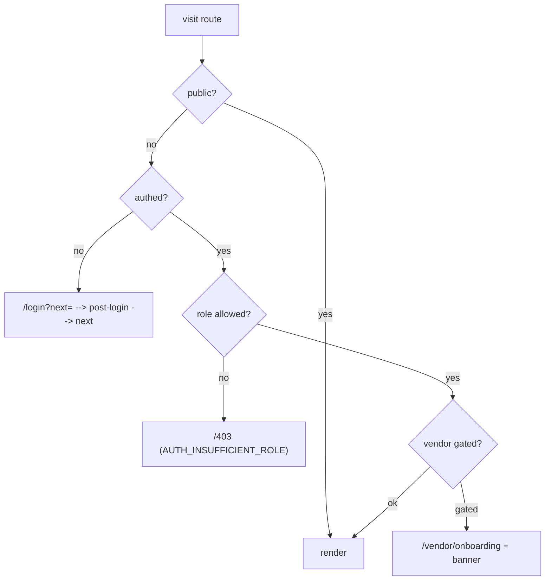
```mermaid
flowchart TD
    V["visit route"] --> P{"public?"}
    P -->|yes| R["render"]
    P -->|no| A{"authed?"}
    A -->|no| LG["/login?next=<route> --> post-login --> next"]
    A -->|yes| RL{"role allowed?"}
    RL -->|no| F["/403 (AUTH_INSUFFICIENT_ROLE)"]
    RL -->|yes| G{"vendor gated?"}
    G -->|gated| OB["/vendor/onboarding + banner"]
    G -->|ok| R
```

<details>
<summary>Plain-ASCII fallback (click to expand)</summary>

```text
visit route --> {public?} --> yes --> render
              +-- no --> {authed?} --> no --> /login?next=<route> --> post-login --> next
                       +-- yes --> {role allowed?} --> no --> /403 (AUTH_INSUFFICIENT_ROLE)
                                 +-- yes --> {vendor gated? (Pending/KYC/Stripe)}
                                           +-- gated + route needs Active --> /vendor/onboarding + banner
                                           |   (VENDOR_NOT_APPROVED / VENDOR_KYC_INCOMPLETE /
                                           |    VENDOR_STRIPE_ONBOARDING_INCOMPLETE)
                                           +-- ok --> render
```

</details>

- Deep links (`/product/:id`, `/store/:slug`, `/search`) are public for sharing; auth prompts only at cart/checkout/review.
- `next` param validated (same-origin only) to prevent open redirects.
- Admin impersonation wraps target screens with yellow banner + Exit (audit-logged).
- All role checks mirrored server-side (RBAC middleware) — client guards are UX only.

---

## 12. Screen to API Wiring

| Screen | Primary APIs | Events / Realtime |
| :--- | :--- | :--- |
| `/register`, `/login` | `POST /auth/register`, `POST /auth/login`, `POST /auth/oauth/:provider` | `UserRegistered` to welcome email |
| `/home`, `/search`, `/product/:id` | `GET /search`, `GET /products/:id`, `GET /recommendations`, `POST /ai/chat` | `SearchExecuted` to ClickHouse |
| `/cart`, `/checkout` | `POST /cart`, `POST /orders/checkout` (idempotency), `POST /payments/intent` | Saga: `OrderCreated` to reserve to charge to dispatch |
| `/order/:id/track` | `GET /orders/:id`, `GET /deliveries?orderId=` | WS `order:<id>` GPS + status |
| `/vendor/products/new` | `POST /products`, `POST /ai/describe`, `POST /uploads` (S3) | `ProductCreated` to ES+Pinecone index |
| `/vendor/orders`, `/payouts` | `GET /vendor/orders`, `POST /payments/payout`, Stripe Express portal | `PaymentSucceeded` to notify |
| `/delivery/jobs`, `/active/:id` | `GET /delivery/jobs?lat=&lng=`, `POST /delivery/:id/accept`, `POST /delivery/:id/location` | WS dispatch + GPS broadcast |
| `/admin/*` | `POST /admin/vendors/:id/approve`, `POST /admin/users/:id/ban`, `GET /analytics/*`, `PUT /admin/flags` | `KycApproved`, `UserBanned` to session revoke |

Conventions: cursor pagination (`?cursor=&limit=`) for search/reviews/orders; `X-Request-Id` on every call; `X-Idempotency-Key` on checkout + payment retry; 401 refresh-once then retry-once; 429 exponential backoff.

---

Conventions: cursor pagination (`?cursor=&limit=`) for search/reviews/orders; `X-Request-Id` on every call; `X-Idempotency-Key` on checkout + payment retry; 401 refresh-once then retry-once; 429 exponential backoff.

---

## 13. Checkout Saga Sequence

This section shows the exact step-by-step behind Screens `/cart` to `/checkout` to `/order/:id/confirmation` to `/order/:id/track`. Read it with Section 3.2.

### 13.1 Place Order happy path

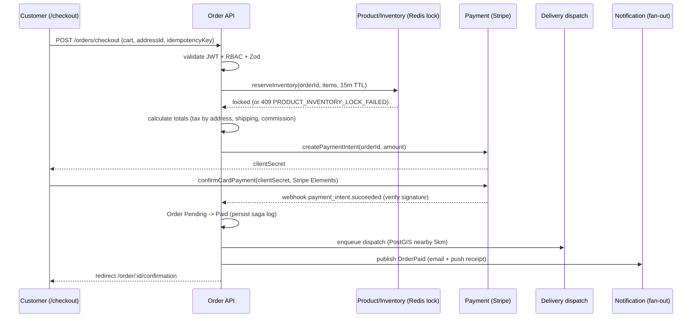
```mermaid
sequenceDiagram
    participant C as Customer (/checkout)
    participant API as Order API
    participant INV as Product/Inventory (Redis lock)
    participant PAY as Payment (Stripe)
    participant DL as Delivery dispatch
    participant NT as Notification (fan-out)
    C->>API: POST /orders/checkout {cart, addressId, idempotencyKey}
    API->>API: validate JWT + RBAC + Zod
    API->>INV: reserveInventory(orderId, items, 15m TTL)
    INV-->>API: locked (or 409 PRODUCT_INVENTORY_LOCK_FAILED)
    API->>API: calculate totals (tax by address, shipping, commission)
    API->>PAY: createPaymentIntent(orderId, amount)
    PAY-->>C: clientSecret
    C->>PAY: confirmCardPayment(clientSecret, Stripe Elements)
    PAY-->>API: webhook payment_intent.succeeded (verify signature)
    API->>API: Order Pending -> Paid (persist saga log)
    API->>DL: enqueue dispatch (PostGIS nearby 5km)
    API->>NT: publish OrderPaid (email + push receipt)
    API-->>C: redirect /order/:id/confirmation
```

Step table:

| Step | Screen shows | API | Timeout / retry |
| :--- | :--- | :--- | :--- |
| 1. Validate | disabled Place Order until valid | Zod + JWT | instant |
| 2. Lock inventory | "Reserving items..." spinner | Redis Redlock 15m | retry once on 409 |
| 3. Totals | summary updates | tax + shipping calc | instant |
| 4. Intent | Stripe card frame | `POST /payments/intent` | 30s timeout |
| 5. Confirm | Stripe 3DS modal if needed | Stripe.js | user-driven |
| 6. Webhook | "Payment processing..." WAIT | `POST /webhooks/stripe` | Stripe retries 3d |
| 7. Paid | confetti + receipt | saga log commit | instant |
| 8. Dispatch | "Finding driver..." on track page | BullMQ dispatch | 60s per driver |
| 9. Notify | toast + bell badge | SendGrid + FCM fan-out | backoff x3 |

### 13.2 Payment failure and retry (cart is KEPT)

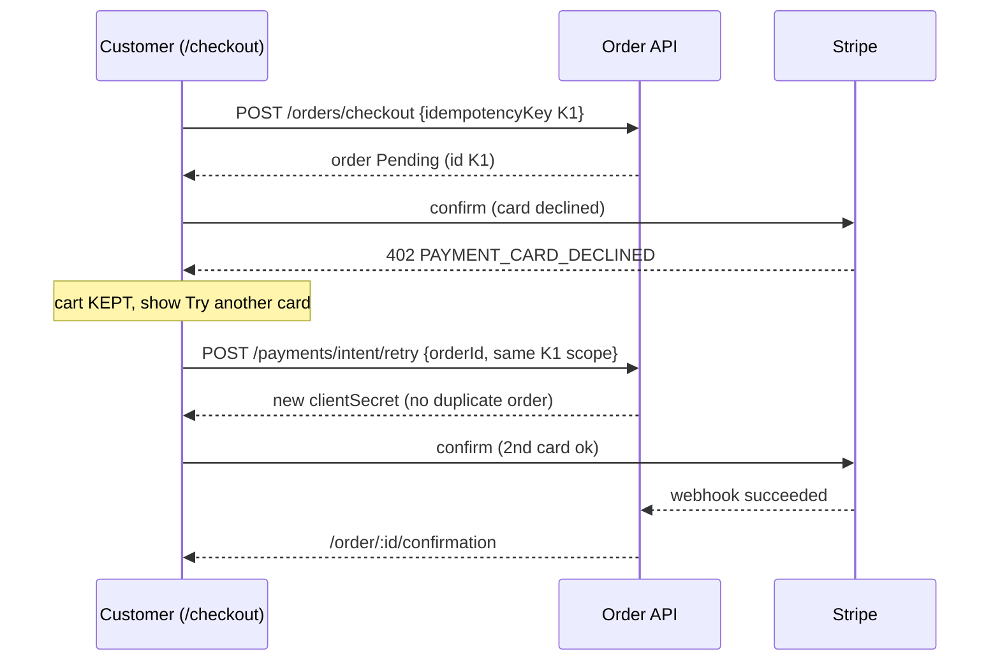
```mermaid
sequenceDiagram
    participant C as Customer (/checkout)
    participant API as Order API
    participant PAY as Stripe
    C->>API: POST /orders/checkout {idempotencyKey K1}
    API-->>C: order Pending (id K1)
    C->>PAY: confirm (card declined)
    PAY-->>C: 402 PAYMENT_CARD_DECLINED
    Note over C: cart KEPT, show Try another card
    C->>API: POST /payments/intent/retry {orderId, same K1 scope}
    API-->>C: new clientSecret (no duplicate order)
    C->>PAY: confirm (2nd card ok)
    PAY-->>API: webhook succeeded
    API-->>C: /order/:id/confirmation
```

Rules:

```text
- Never clear cart on 402. Only clear on Paid.
- [ERR] ORDER_DUPLICATE_IDEMPOTENCY_KEY --> return ORIGINAL order JSON, do not charge twice.
- [ERR] PAYMENT_GATEWAY_TIMEOUT --> show "Check order status before retrying" + link /orders.
- [ERR] PAYMENT_FRAUD_HOLD --> freeze track page at "Under review" + support link, no Cancel button.
- Webhook arriving before API response --> return 200 + upsert (PAYMENT_ALREADY_PROCESSED).
```

### 13.3 Cancel and return branches

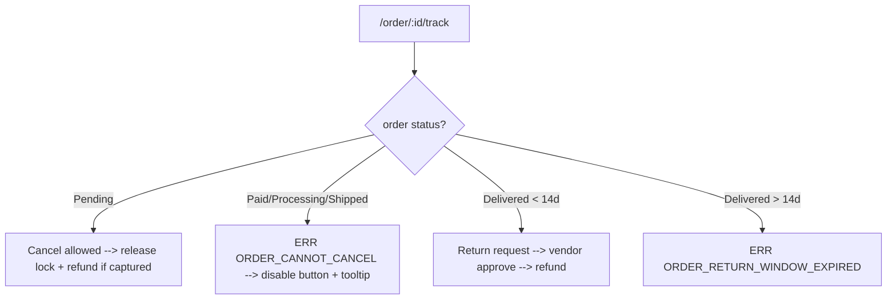
```mermaid
flowchart TD
    T["/order/:id/track"] --> S{"order status?"}
    S -->|Pending| Cancel["Cancel allowed --> release lock + refund if captured"]
    S -->|Paid/Processing/Shipped| NoCancel["ERR ORDER_CANNOT_CANCEL --> disable button + tooltip"]
    S -->|Delivered < 14d| Return["Return request --> vendor approve --> refund"]
    S -->|Delivered > 14d| NoReturn["ERR ORDER_RETURN_WINDOW_EXPIRED"]
```

```text
Cancel (Pending only):
  [Cancel] --> confirm modal (reason select) --> POST /orders/:id/cancel
    +-- ok --> status Cancelled --> inventory released --> refund queued --> toast + email
    +-- [ERR] ORDER_ALREADY_CANCELLED --> idempotent success (show Cancelled page)

Return (Delivered, <14d):
  [Request Return] --> reason + photos --> POST /orders/:id/return
    +-- ok --> status ReturnRequested --> vendor approves in /vendor/orders --> refund --> notify
    +-- [ERR] ORDER_RETURN_NOT_ELIGIBLE --> show why (not Delivered / already returned)
```

---

## 14. Search and AI Sequences

### 14.1 Hybrid search (keyword + semantic)

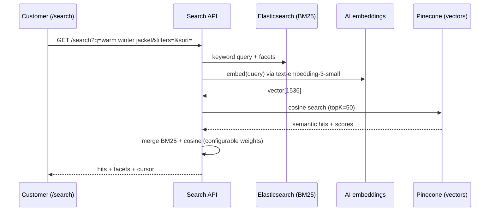
```mermaid
sequenceDiagram
    participant C as Customer (/search)
    participant GW as Search API
    participant ES as Elasticsearch (BM25)
    participant AI as AI embeddings
    participant PC as Pinecone (vectors)
    C->>GW: GET /search?q=warm winter jacket&filters=&sort=
    GW->>ES: keyword query + facets
    GW->>AI: embed(query) via text-embedding-3-small
    AI-->>GW: vector[1536]
    GW->>PC: cosine search (topK=50)
    PC-->>GW: semantic hits + scores
    GW->>GW: merge BM25 + cosine (configurable weights)
    GW-->>C: hits + facets + cursor
```

Behavior per screen:

```text
[/search?q=]
  +-- q < 2 chars --> [ERR] SEARCH_QUERY_TOO_SHORT --> inline hint, no API call
  +-- autocomplete: 3+ chars, 150ms debounce --> GET /search/suggest --> dropdown
  +-- submit --> skeleton cards (6) --> hits render
  +-- Pinecone down --> [WARN] SEARCH_VECTOR_FALLBACK chip "Showing keyword results"
       (success:true + warning field, still usable, log to Sentry)
  +-- ES down --> [ERR] SEARCH_INDEX_UNAVAILABLE --> full-page retry banner (retryable:true)
  +-- new product missing --> note "New products may appear in ~1 min" (SEARCH_SYNC_LAG)
  +-- click result --> POST /analytics/track {event: search_click} --> /product/:id
  +-- pagination: cursor-based "Load more", no page numbers (perf, FR-025)
  +-- filters: price slider, brand checkboxes, rating stars, category tree
       each change --> replace URL query (shareable link) + refetch, facets update
  +-- sort: Relevance | Price low-high | Price high-low | Rating | Newest
```

### 14.2 RAG chatbot (floating, cart-aware)

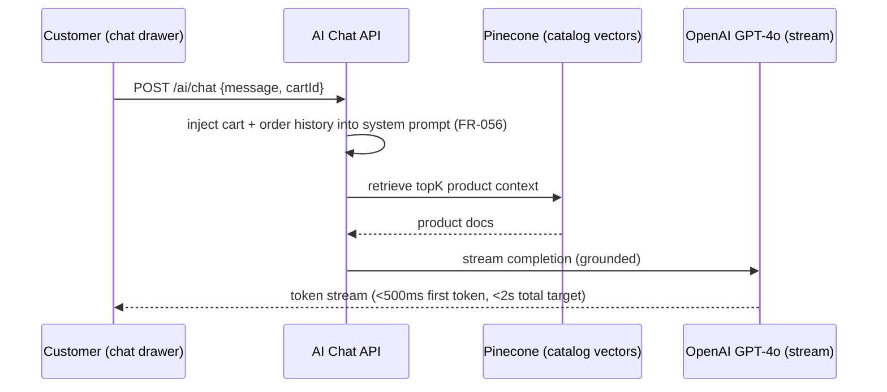
```mermaid
sequenceDiagram
    participant C as Customer (chat drawer)
    participant CH as AI Chat API
    participant PC as Pinecone (catalog vectors)
    participant LLM as OpenAI GPT-4o (stream)
    C->>CH: POST /ai/chat {message, cartId}
    CH->>CH: inject cart + order history into system prompt (FR-056)
    CH->>PC: retrieve topK product context
    PC-->>CH: product docs
    CH->>LLM: stream completion (grounded)
    LLM-->>C: token stream (<500ms first token, <2s total target)
```

Screen states:

```text
Floating button (all shop screens) --> drawer (right on desktop, bottom-sheet on mobile)
  +-- greeting: "Ask about products, sizing, delivery..."
  +-- example chips: "Is this good for skiing?" | "Red dress for summer wedding?"
  +-- streaming: markdown render + product cards inline (click --> /product/:id)
  +-- [ERR] AI_SERVICE_UNAVAILABLE --> "AI offline" empty state, button disabled, search still works
  +-- [ERR] AI_RATE_LIMIT --> "Slow down, retry in Xs" + backoff timer (FR-057)
  +-- [ERR] AI_CONTEXT_TOO_LONG --> auto-truncate history + "Started new thread" notice
  +-- feedback: thumbs up/down per answer --> POST /ai/feedback
  +-- history: per-user thread list, clear button (GDPR: delete on account delete)
```

### 14.3 AI product description (vendor)

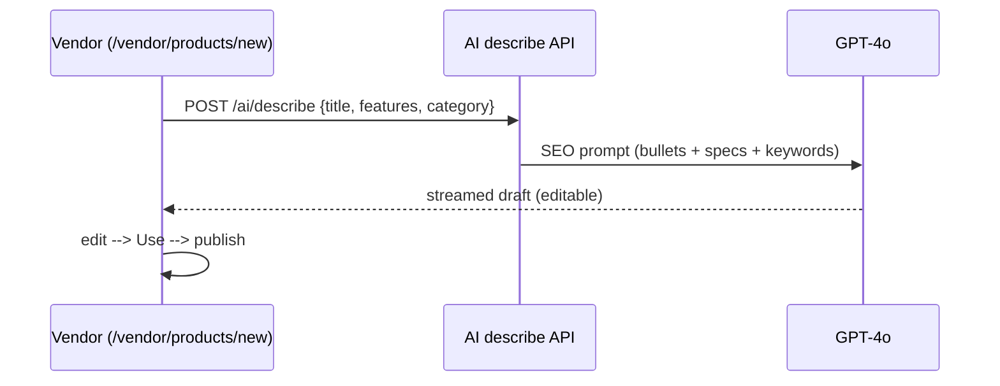
```mermaid
sequenceDiagram
    participant V as Vendor (/vendor/products/new)
    participant AI as AI describe API
    participant LLM as GPT-4o
    V->>AI: POST /ai/describe {title, features, category}
    AI->>LLM: SEO prompt (bullets + specs + keywords)
    LLM-->>V: streamed draft (editable)
    V->>V: edit --> Use --> publish
```

```text
[Generate with AI] button next to description field
  +-- click --> streaming into textarea (cancel button while streaming)
  +-- done --> SEO score (length, keywords, readability) + [Use] [Regenerate] [Discard]
  +-- [ERR] AI_SERVICE_UNAVAILABLE --> disabled with tooltip "AI offline - write manually"
  +-- every generation logged (cost tracking per vendor, rate-limited)
```

---

## 15. Vendor, Delivery and Admin Sequences

### 15.1 Vendor KYC approval

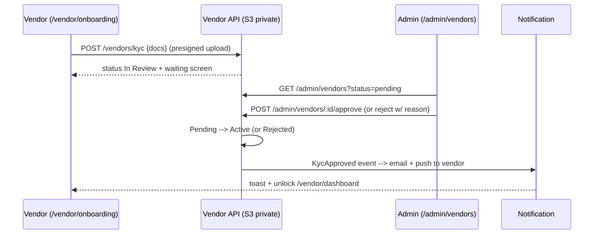
```mermaid
sequenceDiagram
    participant V as Vendor (/vendor/onboarding)
    participant API as Vendor API (S3 private)
    participant M as Admin (/admin/vendors)
    participant N as Notification
    V->>API: POST /vendors/kyc {docs} (presigned upload)
    API-->>V: status In Review + waiting screen
    M->>API: GET /admin/vendors?status=pending
    M->>API: POST /admin/vendors/:id/approve (or reject w/ reason)
    API->>API: Pending --> Active (or Rejected)
    API->>N: KycApproved event --> email + push to vendor
    N-->>V: toast + unlock /vendor/dashboard
```

Screen gating recap:

```text
All /vendor/* except /vendor/onboarding require status Active for write actions.
  +-- Pending/In Review --> waiting screen + [ERR] VENDOR_NOT_APPROVED on publish/payout
  +-- Rejected --> reason card + [Re-submit KYC]
  +-- Suspended --> full-page block + support link ([ERR] VENDOR_SUSPENDED)
  +-- Stripe incomplete --> yellow banner on every vendor page ([ERR] VENDOR_STRIPE_ONBOARDING_INCOMPLETE)
```

### 15.2 Delivery dispatch and live tracking

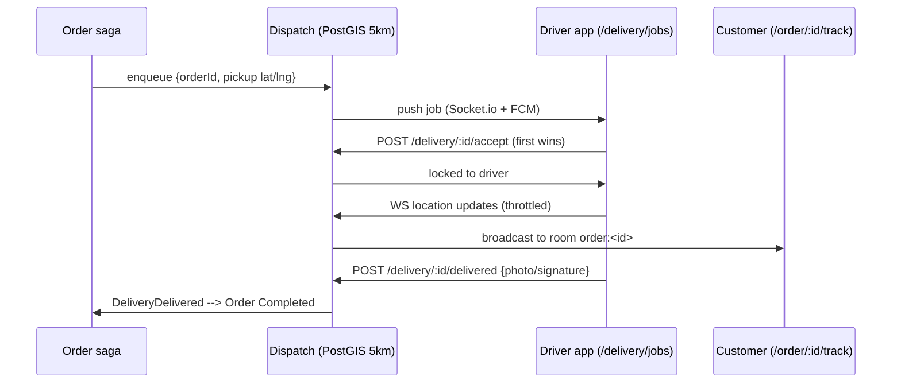
```mermaid
sequenceDiagram
    participant O as Order saga
    participant D as Dispatch (PostGIS 5km)
    participant R as Driver app (/delivery/jobs)
    participant C as Customer (/order/:id/track)
    O->>D: enqueue {orderId, pickup lat/lng}
    D->>R: push job (Socket.io + FCM)
    R->>D: POST /delivery/:id/accept (first wins)
    D->>R: locked to driver
    R->>D: WS location updates (throttled)
    D->>C: broadcast to room order:<id>
    R->>D: POST /delivery/:id/delivered {photo/signature}
    D->>O: DeliveryDelivered --> Order Completed
```

Driver screen steps:

```text
[/delivery/jobs] cards sorted by distance/fee --> [Accept]
  +-- won --> [/delivery/active/:id] locked
  +-- lost --> [ERR] DELIVERY_ALREADY_ACCEPTED --> auto-refresh board
[/delivery/active/:id]
  [Navigate] (Maps deep link) --> [Picked Up] --> [In Transit] --> [Arrive]
    --> proof REQUIRED --> [Delivered]
  +-- GPS lost --> [ERR] DELIVERY_LOCATION_STALE --> last-known pin + "GPS lost" banner
  +-- 60s no-accept --> [ERR] DELIVERY_ASSIGNMENT_EXPIRED --> auto re-route (FR-038)
  +-- 15m stall --> auto rebroadcast (reassign flow)
Customer [/order/:id/track] shows same job read-only: map + ETA + driver masked phone.
```

### 15.3 Review moderation (AI + human)

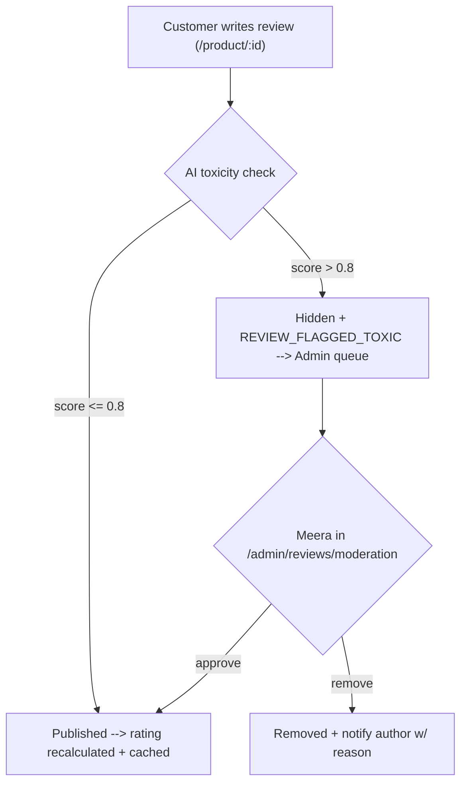
```mermaid
flowchart TD
    W["Customer writes review (/product/:id)"] --> AI{"AI toxicity check"}
    AI -->|score <= 0.8| Pub["Published --> rating recalculated + cached"]
    AI -->|score > 0.8| Hide["Hidden + REVIEW_FLAGGED_TOXIC --> Admin queue"]
    Hide --> M{"Meera in /admin/reviews/moderation"}
    M -->|approve| Pub
    M -->|remove| Del["Removed + notify author w/ reason"]
```

```text
[/product/:id] Reviews Section
  +-- [Write Review] only if Delivered order exists, else [ERR] REVIEW_NOT_ELIGIBLE
  +-- rating 1-5 stars (else [ERR] REVIEW_RATING_INVALID) + text + optional photos
  +-- submit --> "Under moderation" pending state (optimistic) --> published or hidden
  +-- [Helpful] vote --> count++ ([ERR] REVIEW_VOTE_DUPLICATE on double-vote)
[/vendor/reviews] shows own product reviews + [Reply] (nested, parent_review_id)
[/admin/reviews/moderation] queue: text + score + product + author --> Approve / Remove
```

---

## 16. State Machines

### 16.1 Order state machine (FR-030)

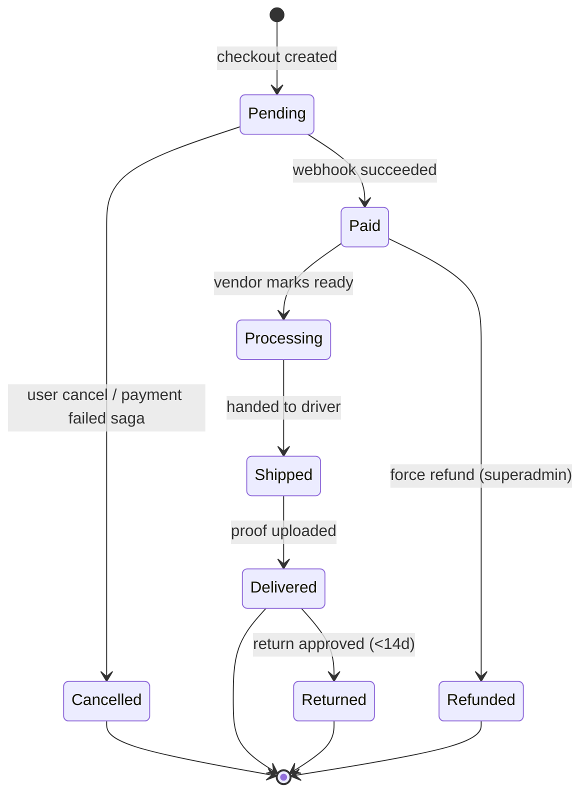
```mermaid
stateDiagram-v2
    [*] --> Pending: checkout created
    Pending --> Paid: webhook succeeded
    Pending --> Cancelled: user cancel / payment failed saga
    Paid --> Processing: vendor marks ready
    Processing --> Shipped: handed to driver
    Shipped --> Delivered: proof uploaded
    Delivered --> Returned: return approved (<14d)
    Paid --> Refunded: force refund (superadmin)
    Cancelled --> [*]
    Delivered --> [*]
    Returned --> [*]
    Refunded --> [*]
```

Screen mapping:

```text
Pending:           [/order/:id/confirmation] shows Cancel button. Track shows step 1/5.
Paid/Processing:   Cancel disabled ([ERR] ORDER_CANNOT_CANCEL). Vendor sees in New/Processing tabs.
Shipped:           Track shows live map + ETA. No cancel.
Delivered:         Track shows proof photo + [Return] [Reorder] [Review] [Invoice].
Cancelled:         Grey timeline + reason + [Reorder].
Returned/Refunded: receipt updated with refund lines.
```

### 16.2 Vendor state machine (FR-011)

```mermaid
stateDiagram-v2
    [*] --> Pending: register
    Pending --> InReview: KYC submitted
    InReview --> Active: admin approve + Stripe complete
    InReview --> Rejected: admin reject w/ reason
    Rejected --> InReview: re-submit KYC
    Active --> Suspended: admin ban / fraud
    Suspended --> Active: admin unban
```

### 16.3 Delivery state machine

```mermaid
stateDiagram-v2
    [*] --> Queued: saga enqueue
    Queued --> Offered: pushed to nearby drivers
    Offered --> Accepted: first accept wins
    Offered --> Queued: 60s timeout --> next driver
    Accepted --> PickedUp: driver at store
    PickedUp --> InTransit: GPS moving
    InTransit --> Arrived: near drop
    Arrived --> Delivered: proof uploaded
    Delivered --> [*]
```

### 16.4 Payment intent states (Stripe)

```mermaid
stateDiagram-v2
    [*] --> RequiresPayment: intent created
    RequiresPayment --> Succeeded: confirm ok + webhook
    RequiresPayment --> RequiresAction: 3DS challenge
    RequiresAction --> Succeeded: challenge passed
    RequiresPayment --> Failed: declined / timeout
    Failed --> RequiresPayment: retry with new intent (same order)
    Succeeded --> Refunded: refund issued
```

---

---

## 17. Detailed Screen Specs - Customer

Format per screen: Purpose / Layout / Components / CTAs / API / Empty-Loading-Error / Acceptance criteria.

### 17.1 Landing (`/`)

- Purpose: convert visitors to signup + SEO entry.
- Layout: header (logo, search teaser, Login, Sign Up, Sell link) / hero (headline + CTA + semantic example chips) / trending rail / categories / AI pitch / vendor CTA / footer.
- Components: hero search input (routes to `/search?q=` public), trending cards (click to `/product/:id`), vendor banner to `/vendor/onboarding`.
- API: `GET /products/trending`, `GET /categories`.
- Criteria: LCP <2s, WCAG AA, hero CTA above fold on 360px mobile.

### 17.2 Register (`/register`) and Login (`/login`)

- Layout: split (marketing panel left on desktop, form card right; stacked on mobile).
- Fields register: name, email, password (strength meter: 12+ upper/lower/num/special), terms checkbox.
- Fields login: email, password, show/hide, remember me, Forgot link, OAuth buttons (Google first, Facebook second).
- Errors: `AUTH_EMAIL_EXISTS` suggests login; `AUTH_INVALID_CREDENTIALS` generic; `AUTH_RATE_LIMITED` shows 15m timer.
- API: `POST /auth/register`, `POST /auth/login`, `POST /auth/oauth/:provider`.
- Criteria: rate-limit copy shown, `next` preserved through OAuth, no enumeration.

### 17.3 Verify Email (`/verify-email`) and Verify Phone (`/verify-phone`)

- Verify email: "Check inbox" + email shown + Resend (60s cooldown) + Open Gmail deep link + wrong-email edit.
- Verify phone: 6-box OTP input (auto-advance, paste support), Resend timer, attempt counter (5 max).
- Errors: `AUTH_OTP_INVALID` shakes box + counter; `AUTH_OTP_EXPIRED` shows Resend primary.
- API: `POST /auth/verify-email`, `POST /auth/verify-email/resend`, `POST /auth/verify-phone`.
- Criteria: keyboard-first (numeric pad on mobile), screen-reader announces attempts left.

### 17.4 Profile Setup (`/profile/setup`)

- Fields: first/last name, phone, default address (street, city, PIN, geocode preview pin), marketing opt-in.
- Actions: Save and Continue (primary), Skip for now (secondary, checkout will force later).
- API: `PUT /users/me`, `POST /users/me/addresses` (geocode async FR-007).
- Errors: `USER_ADDRESS_INVALID` highlights PIN; `USER_DEFAULT_ADDRESS_REQUIRED` enforced on skip-then-checkout.

### 17.5 Homepage (`/home`)

- Layout: greeting row + search bar (sticky) / recommendation rail (horizontal scroll) / category tiles / recent orders strip / deals rail.
- Components: product cards (image, title 2-line clamp, rating, price, wishlist heart), skeleton x8 while loading.
- API: `GET /recommendations`, `GET /orders?limit=3`, `GET /products/deals`.
- Empty: new user sees onboarding checklist + popular categories instead of recommendations.
- Criteria: personalized in <200ms p95 (cached), hearts optimistic with rollback on 401.

### 17.6 Search Results (`/search`)

- Layout: toolbar (query input + voice icon future + sort select) / sidebar facets on desktop, bottom-sheet drawer on mobile / grid 2-col mobile, 4-col desktop / Load more button.
- Facets: price slider (min-max), brand checkboxes with counts, rating minimum stars, category tree, in-stock toggle.
- Badges: `Semantic` vs `Keyword` chip per result when hybrid; fallback chip when `SEARCH_VECTOR_FALLBACK`.
- URL: every filter/sort change rewrites `?q=&brand=&min=&max=&rating=&cat=&sort=&cursor=` (shareable, back-button safe).
- API: `GET /search`, `GET /search/suggest` (autocomplete 3+ chars, 150ms debounce).
- Empty: illustration + "No results for X" + Try chips + popular searches + Clear filters.
- Criteria: p95 <50ms keyword, cursor pagination, no page numbers.

### 17.7 Product Detail (`/product/:id`)

- Layout: breadcrumbs (Home / Category / Title) / gallery left + buy panel right on desktop, stacked with sticky buy bar on mobile / tabs: Description | Specs | Reviews | Shipping.
- Gallery: main + 4 thumbs, zoom on hover (desktop), swipe on mobile, WebP srcset, alt text per image.
- Buy panel: title, rating link (scrolls to reviews), price + MRP strike + price-history sparkline, variant matrix (size pills + color swatches, invalid combo disabled + `PRODUCT_INVALID_VARIANT` tooltip), stock badge (In stock / Only N left / Out of stock + Notify me), qty stepper (clamped to stock), Add to Cart / Buy Now / heart.
- Chatbot FAB bottom-right opens drawer (see 14.2).
- Similar rail: 10 cards from embeddings + "Sponsored" label slot (future).
- Reviews: summary histogram + sort (Most helpful / Recent) + cursor pages + Write Review button.
- API: `GET /products/:id`, `GET /products/:id/similar`, `GET /reviews?productId=`, `POST /cart`.
- Criteria: invalid variant cannot be added; out-of-stock disables CTAs; gallery keyboard navigable.

### 17.8 Cart (`/cart`)

- Layout: lines grouped by vendor header (store name + shipping note) / qty steppers / remove / move to wishlist / summary card (subtotal, shipping, tax, total) / trust row.
- Behavior: qty change re-locks inventory (15m), exceeding stock clamps + toast; remove animates + undo 5s.
- Merge: anonymous (localStorage) merges into Redis on login, dedupe by SKU max qty wins.
- API: `GET /cart`, `PUT /cart/:sku`, `DELETE /cart/:sku`, `POST /cart/merge`.
- Empty: illustration + Shop now + wishlist shortcut.
- Errors: `ORDER_CART_EXPIRED` full-page re-add; `PRODUCT_INVENTORY_LOCK_FAILED` row error + refresh.
- Criteria: summary math matches checkout to the paisa; vendor split visible before checkout.

### 17.9 Checkout (`/checkout`)

- Layout: stepper rail (1 Address, 2 Payment, 3 Review) / main column forms / sticky summary / Place Order bar.
- Step 1 address: radio list + default badge + Add new modal (same fields as setup) + delivery ETA estimate.
- Step 2 payment: Stripe Elements (card number/expiry/CVC separate iframes), saved cards list, UPI slot (future flag).
- Step 3 review: items mini-list + address summary + totals + terms checkbox + idempotency key (dev badge).
- Place Order disabled until: address selected + card valid + locks held + terms checked.
- API: `POST /orders/checkout` + `X-Idempotency-Key`, `POST /payments/intent`, Stripe.js confirm.
- Errors: card declined stays (cart kept); fraud hold freezes; duplicate key returns original (see 13.2).
- Criteria: no raw PAN touches our servers (Stripe only); double-click cannot double-charge.

### 17.10 Confirmation (`/order/:id/confirmation`)

- Hero: check animation + "Order placed!" + order number (copy) + ETA date + receipt table.
- CTAs: Track Order primary, Continue Shopping secondary, Download Invoice tertiary.
- Side: address card + payment last4 + help link.
- API: `GET /orders/:id`.
- Criteria: reachable only by owner (else 403); refresh-safe (idempotent GET).

### 17.11 Tracking (`/order/:id/track`)

- Timeline vertical: Pending > Paid > Processing > Shipped > Delivered with timestamps; current pulsing.
- Map: WebSocket room `order:<id>`, driver pin + route polyline + ETA chip; shimmer while connecting.
- Driver card: first name + masked phone + Call (via relay) + safety note.
- Proof: photo shown on Delivered.
- Actions: Cancel (Pending only), Return (Delivered <14d), Reorder, Review, Invoice.
- API: `GET /orders/:id`, `GET /deliveries?orderId=`, WS subscribe.
- Errors: GPS lost banner; OFFLINE queues timeline refresh.

### 17.12 Orders (`/orders`) and Order Detail (`/order/:id`)

- Orders: filter tabs (All, Pending, Shipped, Delivered, Cancelled) + search by id + cursor list; row: thumb stack, id, date, total, status pill, Track button.
- Detail: full receipt + timeline mini + address + payment + items + actions (same as tracking w/o map).
- API: `GET /orders?status=&cursor=`, `GET /orders/:id`.
- Empty: "No orders yet" + Shop now.

### 17.13 Wishlist (`/wishlist`), Notifications (`/notifications`), Profile (`/profile`), Addresses (`/addresses`)

- Wishlist: grid of saved cards + Move to cart + Remove; empty "Save items you love".
- Notifications: bell-synchronized list (order/dispatched/delivered/price), unread dot, mark-all-read, prefs link; bell badge count = unread.
- Profile: avatar upload (<2MB else `USER_AVATAR_TOO_LARGE`), name, phone, email (verified badge), password change, delete account (soft + anonymize, GDPR).
- Addresses: list with Default badge + Set default + Edit + Delete; exactly 1 default enforced (`USER_DEFAULT_ADDRESS_REQUIRED`).
- APIs: `GET/POST /wishlist`, `GET /notifications`, `PUT /users/me`, `GET/POST/PUT/DELETE /users/me/addresses`.

---

## 18. Detailed Screen Specs - Vendor

### 18.1 Onboarding Wizard (`/vendor/onboarding`)

- Steps: 1 Business (name, GST/PAN, phone) / 2 Store (name, slug live-check, logo) / 3 KYC (doc uploads: ID + address proof, private S3) / 4 Payouts (Stripe Express onboarding link) / 5 Review + Submit.
- Slug field: live availability (`VENDOR_STORE_SLUG_TAKEN` suggests `-2`), URL preview `/store/<slug>`.
- Uploads: drag-drop + progress + virus note; presigned URLs 15m; re-upload allowed while Pending.
- Submit shows waiting screen with checklist + typical 24h SLA + What happens next.
- API: `POST /vendors`, `POST /vendors/kyc`, `GET /vendors/slug-check?slug=`, Stripe onboarding URL.
- Criteria: wizard resumable (draft saved); submit disabled until all required docs present.

### 18.2 Dashboard (`/vendor/dashboard`)

- KPI cards: Revenue (7d + delta), Orders (new count badge), Avg rating, Low-stock count, Payout pending.
- Charts: GMV 7d/30d line, orders by status donut; Action inbox: unfulfilled orders, flagged reviews, KYC/Stripe banners.
- Deep links: every card drills (Revenue to analytics, New orders to filtered orders).
- API: `GET /vendor/stats`, `GET /vendor/alerts`.
- Criteria: cached 60s; banners reflect gating state machine (see 15.1).

### 18.3 Product List (`/vendor/products`) and Edit (`/vendor/products/:id/edit`)

- Table: thumb, title (2-line), SKU count, price range, stock sum, status pill (Draft/Active/Hidden), rating; search + status filter + sort.
- Row actions: Edit, Duplicate, Hide/Unhide, Delete (confirm, only if no pending orders).
- Edit: same form as Add prefilled + version note + danger zone.
- API: `GET /vendor/products`, `PUT /products/:id`, `POST /products/:id/duplicate`.
- Criteria: vendor isolation enforced (only own products; else `PRODUCT_UNAUTHORIZED`).

### 18.4 Add Product (`/vendor/products/new`)

- Left form: title (char count + SEO hint), category tree select, attributes key-value (size/color dynamic rows), variants matrix auto-generated with per-variant price delta + SKU (unique check live) + stock, price + MRP, images (multi-upload, reorder drag, WebP auto, per-file errors), description (textarea + AI button).
- Right preview: live storefront card + mobile/desktop toggle.
- AI: Generate streams, SEO score, Use/Regenerate/Discard (see 14.3).
- Publish: validates (price + >=1 image + category + vendor Active) else `PRODUCT_STATUS_INVALID` with field links.
- API: `POST /products`, `POST /uploads` (S3), `POST /ai/describe`.
- Criteria: duplicate SKU blocked inline; publish triggers async ES+Pinecone index + "appears shortly" toast.

### 18.5 Inventory (`/vendor/inventory`) and Bulk Import (`/vendor/products/import`)

- Inventory: SKU table with current qty + delta stepper + reason select (restock/sale-adjust/damage) + ledger link; low-stock threshold per SKU.
- Every change writes `inventory_transactions` ledger row (audit).
- Import: CSV template download + Upload + column mapping preview + background job progress bar + error report download (row, reason).
- API: `PUT /inventory/:sku`, `GET /inventory/transactions`, `POST /products/bulk-import`.
- Errors: `PRODUCT_BULK_IMPORT_FAILED` shows report; negative stock blocked.
- Criteria: large CSVs never block UI (async + email on done).

### 18.6 Vendor Orders (`/vendor/orders`, `/vendor/orders/:id`)

- Tabs: New / Processing / Completed / Cancelled with counts; table: order id, date, items count, total (vendor share), status, SLA timer.
- Detail drawer/page: items (own SKUs only), customer city + PIN (no full PII), saga state, timeline, Mark Ready / Print label / Contact support.
- Buttons reflect state machine (disabled with tooltip on invalid transition, else `ORDER_INVALID_STATE_TRANSITION`).
- API: `GET /vendor/orders?status=`, `GET /vendor/orders/:id`, `POST /vendor/orders/:id/ready`.
- Criteria: only own line-items visible (multi-vendor order split).

### 18.7 Payouts (`/vendor/payouts`, `/vendor/payouts/:id`)

- Overview: Available vs Pending cards + progress to Rs 500 minimum + Next payout date + Bank status.
- History table: date, amount, Stripe transfer id, status (Pending/Paid/Failed); row drills to receipt.
- Bank settings: Stripe Express portal button (opens Stripe, returns with `?refresh` handling).
- API: `GET /vendor/payouts`, `GET /vendor/payouts/:id`, `POST /vendor/stripe-portal`.
- Errors: `VENDOR_PAYOUT_MINIMUM` progress bar; `PAYMENT_PAYOUT_FAILED` shows retry + support.
- Criteria: amounts in paise formatted INR; failed payouts alert finance.

### 18.8 Reviews (`/vendor/reviews`)

- Filters: All / Flagged / 5-star to 1-star; list: rating, text, author masked, product, date, Helpful count, Reply thread.
- Reply box nested (one reply per review, editable 24h), `parent_review_id` stored.
- Flagged show "Hidden - under admin review" read-only.
- API: `GET /vendor/reviews`, `POST /reviews/:id/reply`.
- Criteria: reply posted appears instantly with Pending badge if re-moderated.

### 18.9 Analytics (`/vendor/analytics`)

- Charts: GMV time-series (date-range picker), Top products table (SKU, sold, revenue), Demographics bars (city), Conversion funnel (views to cart to paid).
- Export: date range + Export CSV (async, `ANALYTICS_REPORT_PENDING` progress + download link + email).
- Ask AI: input "top category this month?" + Run + chart + collapsible generated SQL + disclaimer.
- API: `GET /vendor/analytics/*`, `POST /vendor/reports`, `POST /analytics/nl-query`.
- Criteria: tenant isolation (only own `vendor_id`); heavy queries cached 5m.

### 18.10 Settings (`/vendor/settings`) and Storefront (`/store/:slug`)

- Settings tabs: Store Profile (name, slug locked after Active + contact, logo/banner upload, return policy rich text, hours) with live preview phone frame; KYC (status card + re-upload); Notifications (order/review/payout toggles); Commission (read-only tier + calculator).
- Storefront public: banner + logo + policies + product grid (search within store) + rating summary; Share button copies link.
- API: `PUT /vendors/me`, `POST /vendors/kyc`, `GET /store/:slug`.
- Criteria: slug change requires support (SEO); policy HTML sanitized (XSS).

---

## 19. Detailed Screen Specs - Delivery, Admin and Shared

### 19.1 Delivery Login (`/delivery/login`), Jobs (`/delivery/jobs`), Active (`/delivery/active/:id`)

- Login: phone + OTP (same OTP infra as customer), vehicle select on first login, availability toggle default ON.
- Jobs: cards sorted distance then fee; each: pickup name, drop area (masked until accept), fee, distance km, ETA; pull-to-refresh; empty "Go online and wait for jobs".
- Active: header order id + timer; big buttons Navigate / Picked Up / Arrive / Delivered (sequential unlock); proof sheet (camera + signature pad) REQUIRED before Delivered; GPS status dot; Drop/Reassign secondary.
- Earnings (`/delivery/earnings`): today/week cards + bar chart + trip table (id, date, fee, tip); Profile (`/delivery/profile`): vehicle, docs, availability, battery-saver note, logout.
- APIs: `POST /delivery/otp`, `GET /delivery/jobs?lat=&lng=`, `POST /delivery/:id/accept`, `POST /delivery/:id/location` (WS too), `POST /delivery/:id/proof`, `GET /delivery/earnings`.
- Criteria: works on 2G (throttled GPS 10s, queued offline actions); big touch targets 48px+.

### 19.2 Admin Dashboard (`/admin/dashboard`) and Vendors (`/admin/vendors`)

- Dashboard: KPI wall (GMV, DAU, orders/min, search conversion, chatbot resolution, uptime) + alert swimlanes (Fraud holds, Toxic reviews, Failed webhooks, ES lag) each with View queue link + severity color.
- Vendors: queue tabs Pending/In Review/Active/Suspended; table: store, owner, docs status, GMV, rating; Approve/Reject modal (reason required on reject); row drills to 360 view (KYC viewer presigned 15m, store preview, products, payouts, audit trail); Ban with confirm + reason (revokes sessions).
- APIs: `GET /admin/kpis`, `GET /admin/vendors?status=`, `POST /admin/vendors/:id/approve|reject|ban`.
- Criteria: every action writes audit log + toast with Undo window only for non-destructive.

### 19.3 Admin Users (`/admin/users`), Orders (`/admin/orders`, `/admin/orders/:id`), Fraud (`/admin/fraud`)

- Users: search (email/phone/id) + role filter + Ban/Unban + Impersonate (superadmin only, yellow banner + Exit + audit).
- Orders: all-tenant table + status filter + saga inspector drill (transitions log with timestamps + payload viewer + retry saga button for stuck).
- Fraud: risk queue cards (score 0-100 with factors: IP mismatch, velocity, value sigma) + Approve / Hold / Ban + vendor; held order shows customer `AI_FRAUD_REVIEW_REQUIRED`.
- APIs: `GET /admin/users`, `POST /admin/users/:id/ban|impersonate`, `GET /admin/orders`, `POST /admin/orders/:id/retry-saga`, `POST /admin/fraud/:id/approve|hold`.
- Criteria: PII masked by default (reveal with audit); force refund superadmin-only + double confirm.

### 19.4 Admin Reviews (`/admin/reviews/moderation`), Analytics (`/admin/analytics`), Flags (`/admin/flags`), Config (`/admin/config`), Audit (`/admin/audit`), Health (`/admin/health`)

- Reviews: toxic queue (score, text, product, author) + Approve / Remove (reason) + auto-hidden badge; bulk actions.
- Analytics: platform charts (GMV, DAU, funnel) + Ask AI NL box (shows SQL) + Export (async).
- Flags: toggle list with rollout % slider + instant pub/sub note + audit per toggle.
- Config: fees/commission inputs with validation (`ADMIN_CONFIG_INVALID` on negative) + maintenance toggle with message + Save (double confirm in prod).
- Audit: immutable table (actor, action, target, time, IP) + filters + export; no edit/delete buttons by design.
- Health: service dots (Postgres/Redis/ES/Pinecone/Stripe/OpenAI) + latency + last deploy + link to `/health/ready` JSON.
- APIs: `POST /admin/reviews/:id/approve|remove`, `GET /analytics/platform`, `PUT /admin/flags/:key`, `PUT /admin/config`, `GET /admin/audit`, `GET /health/ready`.
- Criteria: config change shows "applies to subsequent orders" note; maintenance shows customer banner.

### 19.5 Shared: 403, 404, 500, Maintenance

- 403 (`/403`): lock illustration + "You don't have permission" + Switch account + Home; logs `AUTH_INSUFFICIENT_ROLE`.
- 404 (`/404`): search box + popular links + Home; tracks missing route for content gaps.
- 500 (`/500`): "Something went wrong (Ref: requestId)" + Retry + Support + Copy ref; never shows stack.
- Maintenance (`/maintenance`): full-page notice + `retryAfter` countdown + status link; triggered by `MAINTENANCE_MODE`.
- Criteria: all four work offline-cached (PWA) + correct HTTP status on SSR.

---

## 20. Wireframes

Plain-ASCII sketches (monospace-safe: only `+ - | >` used). Use with Section 9 specs.

### 20.1 Product Detail (desktop)

```text
+------------------------------------------------------------------+
| Logo   [search................]   Heart  Cart(2)  Bell  Avatar  |
+------------------------------------------------------------------+
| Home / Electronics / Headphones                                  |
+----------------------------+-----------------------------------+
| +------------------------+ | Title Headphones Pro              |
| |                        | | Stars 4.6 (2.3k)  See reviews >   |
| |   MAIN IMAGE           | | Rs 4,999  MRP Rs 7,999  -38%      |
| |                        | | Variant: [S] [M] [L]  Color o o o |
| +------------------------+ | Stock: Only 3 left                |
| | t1 | t2 | t3 | t4 |      | Qty [- 1 +]                         |
| +------------------------+ | [ Add to Cart ]  [ Buy Now ]  (H) |
+----------------------------+-----------------------------------+
| Tabs: Description | Specs | Reviews | Shipping                   |
+------------------------------------------------------------------+
| Chat button (bottom-right): ( ? )                                |
+------------------------------------------------------------------+
```

### 20.2 Checkout (3 steps)

```text
+------------------------------------------------------------------+
| Checkout   Step: (1) Address > (2) Payment > (3) Review          |
+-------------------------------+----------------------------------+
| (o) Home - 123 MG Road...     | Summary                         |
| ( ) Office - 45 Park St...    | 2 items  Rs 5,498               |
| [+ Add new address]           | Shipping Rs 49                  |
|                               | Tax      Rs 495                  |
| Card: [____ ____ ____ ____]   | Total    Rs 6,042               |
| Exp [__/__]  CVC [___]        |                                 |
| [x] I agree to terms          | [ Place Order - Rs 6,042 ]      |
+-------------------------------+----------------------------------+
```

### 20.3 Order Tracking

```text
+------------------------------------------------------------------+
| Order #ORD-88231   ETA Tomorrow 2pm              [Cancel]       |
+-------------------------------+----------------------------------+
| o Pending    10:02            |  +----------------------------+  |
| o Paid       10:03            |  |                            |  |
| o Processing 10:20            |  |        MAP (live pin)      |  |
| > Shipped    11:05 (current)  |  |   Driver: Ravi 4.8 (*)     |  |
| . Delivered  --               |  +----------------------------+  |
+-------------------------------+----------------------------------+
| [Return] [Reorder] [Review] [Invoice]                            |
+------------------------------------------------------------------+
```

### 20.4 Vendor Dashboard

```text
+--------+---------------------------------------------------------+
| Side   | Overview                                    [+ Add]   |
| - Over | +----------+ +----------+ +----------+ +----------+  |
| - Prod | | Revenue  | | Orders   | | Rating   | | Low stk  |  |
| - Ordr | | Rs 82k   | | 214 (12+) | | 4.7     | | 5 SKUs   |  |
| - Pay  | +----------+ +----------+ +----------+ +----------+  |
| - Rev  | GMV last 7 days [____________line____________]        |
| - Anal | Inbox: 3 new orders | 1 flagged review | KYC ok     |
| - Sett |                                                        |
+--------+---------------------------------------------------------+
```

### 20.5 Admin Fraud Queue

```text
+------------------------------------------------------------------+
| Fraud Review   Filter: [All v]  Sort: [Risk v]  [Health]        |
+------------------------------------------------------------------+
| [Score 92] ORD-99120 Rs 48,999  IP mismatch + velocity  [Hold]  |
|   Factors: new account + high value + 3 orders/10m   [Approve]  |
+------------------------------------------------------------------+
| [Score 78] ORD-99133 Rs 12,499  value sigma          [Ban]      |
+------------------------------------------------------------------+
```

### 20.6 Delivery Active Job (mobile 360px)

```text
+----------------------+
| ORD-88231  00:12:44 |
| Pickup: Store A      |
| Drop: 2.1km Sector 5 |
| [ Navigate > ]       |
| [ Picked Up ]        |
| [ Arrive ]           |
| [ Delivered ]        |
| GPS: (on) Battery OK |
+----------------------+
```

---

## 21. Analytics Events per Screen

Fire-and-forget (never block UI). All carry `requestId`, `userId?`, `role`, `route`.

| Screen | Event | Payload | Sink |
| :--- | :--- | :--- | :--- |
| `/`, `/home` | `page_view` | route, referrer | ClickHouse |
| `/search` | `search_executed` | q, filters, sort, hitCount, fallback? | ClickHouse |
| `/search` click | `search_click` | q, productId, rank | ClickHouse |
| `/product/:id` | `product_view` | productId, vendorId, variant? | ClickHouse |
| `/product/:id` chat | `chat_message` | threadId, helpful? | ClickHouse + cost log |
| `/cart` | `cart_add`, `cart_remove` | sku, qty | ClickHouse |
| `/checkout` | `checkout_start`, `checkout_place` | orderId?, total, idempotencyKey | ClickHouse |
| `/order/:id/confirmation` | `purchase` | orderId, total, vendorSplit | ClickHouse (GMV) |
| `/vendor/products/new` AI | `ai_describe` | vendorId, tokens | cost log |
| `/vendor/analytics` export | `report_export` | vendorId, range | audit + ClickHouse |
| `/delivery/active/:id` | `delivery_status` | deliveryId, status, lat/lng | Postgres + WS |
| `/admin/*` any action | `admin_action` | actor, action, target | audit_logs (immutable) |

Sampling: `page_view` 100%, `product_view` 100% (funnel-critical), GPS 10s throttle.

---

## 22. Responsive and Accessibility Notes

### 22.1 Breakpoints and navigation

```text
Mobile  (360-768):  bottom nav (Home, Search, Cart, Orders, Account)
                    shop screens stacked, sticky buy/place bar, chatbot bottom-sheet
                    vendor/admin read-only cards (edit on desktop hint)
Tablet  (768-1024): 2-col grids, sidebar becomes drawer
Desktop (1024+):    full sidebar (vendor/admin), 4-col grids, hover zoom, drawer chatbot right
```

### 22.2 Accessibility checklist (WCAG 2.1 AA, per screen)

- All forms: label + error `aria-describedby`, focus moves to first error on submit.
- OTP: single-field fallback + `inputmode=numeric`, announces attempts left via `aria-live`.
- Gallery/map: alt text + keyboard arrows; map has list alternative (timeline) for screen readers.
- Contrast 4.5:1 text, 3:1 large/UI; focus ring visible on every CTA.
- Toasts/banners use `role=status` / `role=alert`; countdowns (OTP, retryAfter) announced politely.
- Reduced motion: confetti + map animation disabled via `prefers-reduced-motion`.
- Touch: 44px+ targets (48px driver app), 8px+ spacing, no hover-only actions.

### 22.3 Performance budgets (per screen)

- LCP <2s landing/home/product (CDN images WebP), search p95 <50ms, API p95 <200ms.
- Skeletons for every list; images lazy + blur-up; chatbot streams first token <500ms.
- Offline: track + delivery-active cached (stale-while-revalidate); 403/404/500 pre-cached.

---

*New screen? Add route + role + guard to Section 8, spec to Sections 9 / 17-19, wireframe to Section 20 if flagship, APIs to Section 12, event to Section 21 in the same PR.*
